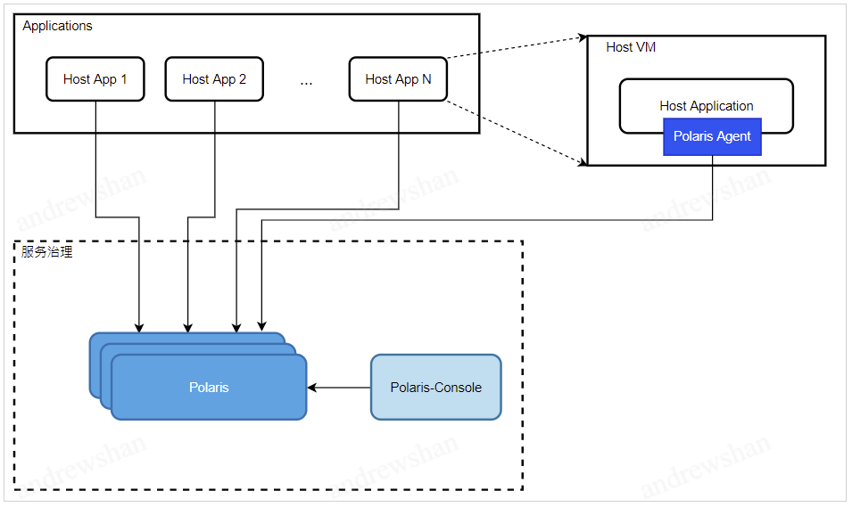

# polaris-java-agent

English | [中文](./README-zh.md)

- [Introduction](#Introduction)
- [Architecture](#Architecture)
- [ConfigDescription](#ConfigDescription)
- [User-Guide](#Guide)

## Introduction

polaris-java-agent provides a non-invasive way for Java applications to connect with polaris for service management, and provides the following functions:

- [x] Service registration discovery
- [x] Dynamic routing and load balancing
- [x] The faulty node is blown
- [x] Service throttling

Currently, Java applications developed based on the following frameworks are supported for access:

- [x] dubbox(version >= 2.8.4)
- [x] dubbo(version >= 2.7.0)
- [ ] spring-cloud(version >= 2020.0.0)

This document describes how to use polaris-java-agent to access polaris service governance.

## Architecture

polaris-java-agent injects interceptors into applications through Java bytecode enhancement technology to realize the docking of Polaris service governance capabilities.

## ConfigDescription

polaris-java-agent provides the following configuration items, all of which can be configured through files (polaris.config) and system variables (-D parameters).

| Configuration item | Meaning | Required | Default value |
| --------------------------------- | ------------------------ | -------- | ------- |
| agent.application.namespace | namespace for the service | no | default |
| agent.application.name | application name, used for monitoring display | yes | no |
| agent.polaris.registry | Polaris server IP address | Yes | No |
| agent.application.healthcheck.ttl | Service check check TTL, in seconds | no | 5 |
| agent.consumer.refresh.interval | Service list refresh interval, in seconds | No | 2 |

## Guide

- [dubbo2 access](./polaris-agent-examples/dubbo2/README.md)
- [dubbox access](./polaris-agent-examples/dubbox/README.md)