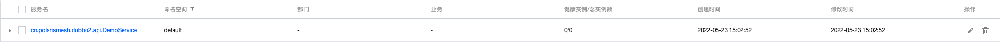
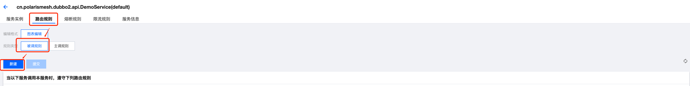
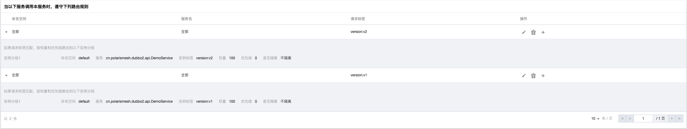
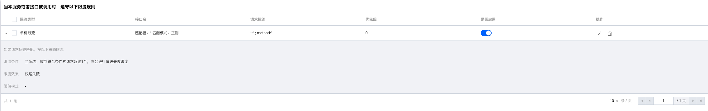
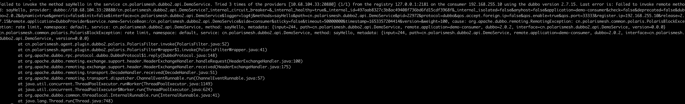

# dubbo2-example

English | [中文](./README-zh.md)

## Install Server

You need to install the Polaris server first, you can refer to [Installation Guide](https://polarismesh.cn/zh/doc/Quick Start/Install Server/Install Standalone.html)

## Install call chain components [optional]

Collector and hbase components need to be installed, please refer to [Installation Guide](https://github.com/polarismesh/polaris-java-agent/issues/20)

## Configure the java-agent package

- Package download: Download the latest version of **polaris-pinpoint-agent-${version}.zip** from [release](https://github.com/polarismesh/polaris-java-agent/releases/tag/${version}), and unzip it.
- Configure the Polaris server address: enter the **polaris-pinpoint-agent-${version}** directory, open the polaris.config file, and modify the **agent.polaris.registry** configuration item to the Polaris server IP port address, The port uses 8091.
- Configure the collector address: enter the **polaris-pinpoint-agent-${version}** directory, open pinpoint-root.config, and modify **profiler.transport.grpc.collector.ip** to the collector's IP address.

## Start the dubbo2 application

- Example of running code: [dubbo2-example](./)

- Add java-agent to start VM parameters, and start the sample:

- DubboProvider
```shell
java -javaagent:${java-agent installation directory}/polaris-java-agent-${version}/pinpoint-polaris-bootstrap-${version}.jar -Dagent.application.name=DubboProvider -jar xxx.jar
````

-DubboConsumer

```shell
java -javaagent:${java-agent installation directory}/polaris-java-agent-${version}/pinpoint-polaris-bootstrap-${version}.jar -Dagent.application.name=DubboConsumer -jar xxx.jar
````

## Installation verification

- Check whether the service has been registered to Polaris: Open ```https://${Polaris server IP}:8080``` through the browser, open the Polaris console, you can see the demo registered service, if it exists under the service A healthy instance proves that the service registration is successful.



## Function usage

### Service routing

Polaris supports service routing capabilities. By setting routing rules, it supports addressing the list of called party instances with specific labels according to the matching relationship between the request labels of the calling party, which can support the following scenario requirements

- Version grayscale
- Canary test
- A/B testing

**Polaris-Java-Agent** allows users to match rules through the following tags:

- Key Dispatcher tab
  - Method name: the target method name of this call, the key is method
  - Default static label: The default static label of dubbo, including application, interface, path, version, protocol.
  - Custom static tags: static tags configured by adding <dubbo:parameter> to the reference
  - Dynamic tags: Attachment data for service calls, which can be passed in through RPCContext.setAttachment.

- Scheduled label
  - Instance metadata information: add tag data configured by <dubbo:parameter> in the service.

Example of use:

- Start `DubboProvider-1`, `DubboProvider-2`, `DubboConsumer-1`, `DubboConsumer-2` respectively
  - DubboProvider-1: configure the **spring/dubbo-provider.xml** file
  ````xml
  <dubbo:service interface="cn.polarismesh.dubbo2.api.DemoService" ref="demoServiceImpl" version="v1.0.0" />
  ````
  - DubboProvider-2: configure the **spring/dubbo-provider.xml** file
  ````xml
  <dubbo:service interface="cn.polarismesh.dubbo2.api.DemoService" ref="demoServiceImpl" version="v2.0.0" />
  ````
  - DubboConsumer-1: Configure the **spring/dubbo-consumer.xml** file
  ````xml
  <dubbo:reference id="demoService" check="false" interface="cn.polarismesh.dubbo2.api.DemoService" version="v1.0.0"/>
  ````
  - DubboConsumer-2: configure the **spring/dubbo-consumer.xml** file
  ````xml
  <dubbo:reference id="demoService" check="false" interface="cn.polarismesh.dubbo2.api.DemoService" version="v2.0.0"/>
  ````
- Open the Polaris console, open the service named `cn.polarismesh.dubbo2.api.DemoService`, and create a new routing rule at the routing rule:
  
- Create new routing rules as follows:
  
- Initiate an http request call to **DubboConsumer**
```shell
curl http://127.0.0.1:${CONSUMER's listening port}/echo
````
- Observe the output of `DubboConsumer`: `DubboConsumer` requests with version `v1.0.0` are always routed to port `20880`, and `DubboConsumer` requests with version `v2.0.0` are always routed to port `20890`, indicating routing Rules take effect


### Load Balancing

Polaris remote load balancing configuration does not yet support remote configuration. Currently, Polaris and Polaris load balancing can be used by modifying the client configuration.

You can modify the configuration content of polaris.yml:

````
#Description: Host configuration
consumer:
  #Description: Load balancing related configuration
  loadbalancer:
    #Description: Currently supports weightedRandom (weighted random), ringHash (consistent hash)
    type: weightedRandom
````

### Fusing

- Start `DubboProvider-1`, `DubboProvider-2`, `DubboConsumer` respectively
- close one of the `provider`, all requests will import the other `provider`

### Limiting

- Start `DubboProvider` and `DubboConsumer`
- Open the Polaris console, open the service named `cn.polarismesh.dubbo2.api.DemoService`, and create a new current limiting rule at the current limiting rule
  
- Create a new current limiting rule, you can limit the current according to the request label, and set the current limiting rule, which will take effect after the new rule is created
  
- Start `DubboConsumer`, if the request rate exceeds the current limit rule, you can see the corresponding error
  

### Service governance monitoring

- You need to go to the `${polaris-java-agent installation directory}/polaris/conf` directory, modify the polaris.yml configuration, and enable monitoring data reporting:
````
global:
  statReporter:
    # Enable monitoring data reporting
    enable: true
    plugin:
      prometheus:
        # pushgateway address
        pushgatewayAddress: 127.0.0.1:9091
````
- Log in to the Polaris console, and you can see the monitoring chart data in the left column of observability.