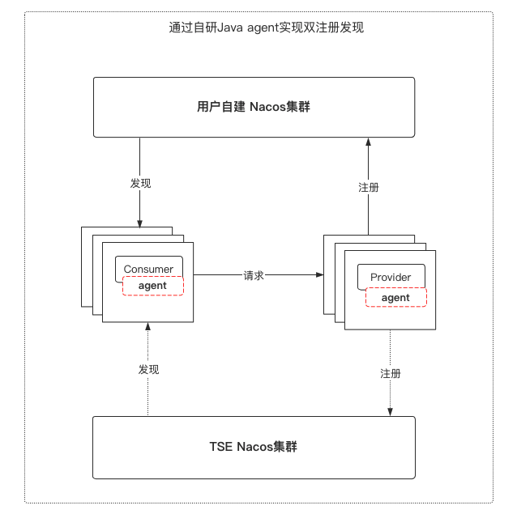

# Nacos Java Agent

- [简介](#简介)
- [使用指南](#使用指南)
  - [Nacos 迁移](#nacos-迁移)
  - [Nacos 多活容灾](#nacos-多活容灾)
- [参数配置](#参数配置)
- [版本支持](#版本支持)

## 简介

nacos-plugins是基于 [polaris-java-agent](../../../README-zh.md) 开发的针对nacos-client的插件，得益于polaris-java-agent的无侵入性，nacos-plugins 也可以通过无侵入的方式，为使用了nacos-client的Java应用提供了服务双注册双发现及就近路由的功能。

nacos-all-plugin屏蔽了不同nacos-client版本之间的差异，只需要通过配置系统变量-Dplugins.enable=nacos-all-plugin(详见最后的版本支持介绍)即可开启服务双注册双发现及就近路由的能力，主要应用于以下场景：

- Nacos 迁移
- Nacos 多活容灾

## 使用指南

### Nacos 迁移



#### 应用场景说明
支持将应用从当前nacos集群平滑迁移到另一个nacos集群，如：将应用从自建nacos集群迁移到腾讯云的TSE nacos集群，另外TSE nacos还提供了数据迁移的能力，可以将nacos依赖的db里面的数据实时同步到TSE nacos的db里面。

#### 示例

假设目前有一个nacos集群cluster-1(地址为192.168.1.11:8848)，要迁移到另一个nacos集群cluster-2((地址为192.168.1.22:8848)。cluster-1下分别有个provider和consumer应用，每个应用部署了2个节点，分别为provider-1、provider-2、consumer-1，consumer-2。

* 迁移前

  ```shell
  
  # provider-1,provider-2
  java 
  	-jar provider.jar 
  	--spring.application.name=provider --nacos.discovery.server-addr=192.168.1.11:8848
  #consumer-1,consumer-2 
  java 
  	-jar consumer.jar 
  	--spring.application.name=consumer --nacos.discovery.server-addr=192.168.1.11:8848
  
  ```

* 迁移中

  ```shell
  # provider-1
  java 
    -javaagent:/***/polaris-java-agent-v*/polaris-agent-core-bootstrap.jar
    -Dplugins.enable=nacos-all-plugin  
    -Dnacos.cluster.name=cluster-1
    -Dother.nacos.server.addr=192.168.1.22:8848
  	-jar provider.jar 
  	--spring.application.name=provider --nacos.discovery.server-addr=192.168.1.11:8848
  	
  # provider-2
  java 
    -javaagent:/***/polaris-java-agent-v*/polaris-agent-core-bootstrap.jar
    -Dplugins.enable=nacos-all-plugin  
    -Dnacos.cluster.name=cluster-2
    -Dother.nacos.server.addr=192.168.1.11:8848
  	-jar provider.jar 
  	--spring.application.name=provider --nacos.discovery.server-addr=192.168.1.22:8848	
  
  #consumer-1
  java 
    -Dplugins.enable=nacos-all-plugin  
    -Dnacos.cluster.name=cluster-1
    -Dother.nacos.server.addr=192.168.1.22:8848
  	-jar consumer.jar 
  	--spring.application.name=consumer --nacos.discovery.server-addr=192.168.1.11:8848
  	
  #consumer-2
  java 
    -javaagent:/***/polaris-java-agent-v*/polaris-agent-core-bootstrap.jar
    -Dplugins.enable=nacos-all-plugin  
    -Dnacos.cluster.name=cluster-2
    -Dother.nacos.server.addr=192.168.1.11:8848
  	-jar consumer.jar 
  	--spring.application.name=provider --nacos.discovery.server-addr=192.168.1.22:8848
  	
  ```

  此时应用会同时注册到cluster-1和cluster-2，从而实现滚动平滑迁移。

* 迁移后

  ```shell
  
  # provider-1,provider-2
  java 
  	-jar provider.jar 
  	--spring.application.name=provider --nacos.discovery.server-addr=192.168.1.22:8848
  #consumer-1,consumer-2 
  java 
  	-jar consumer.jar 
  	--spring.application.name=consumer --nacos.discovery.server-addr=192.168.1.22:8848
  ```


### Nacos 多活容灾

#### 应用场景说明

支持不同云、IDC机房之间的应用访问，提供同一云内或者同一IDC机房内优先路由的能力，如：用户在自建IDC机房和腾讯云分别部署了一整套服务应用和nacos集群，当腾讯云内的应用A调用应用B服务时，优先访问腾讯云内的应用B，如果找不到，则从自建IDC机房访问应用B。
#### 接入方式

启动应用，接入 Nacos 集群1

```shell
java
  -javaagent:/***/polaris-java-agent-v*/polaris-agent-core-bootstrap.jar
  -Dplugins.enable=nacos-xxx-plugin
  -Dnacos.cluster.name=cluster-1
  -Dother.nacos.server.addr=xx.xx.xx.xx
  -Drouter.nearby.level=nacos_cluster
-jar xx.jar
```

启动应用，接入 Nacos 集群2

```shell
java
  -javaagent:/***/polaris-java-agent-v*/polaris-agent-core-bootstrap.jar
  -Dplugins.enable=nacos-xxx-plugin
  -Dnacos.cluster.name=cluster-2
  -Dother.nacos.server.addr=xx.xx.xx.xx
  -Drouter.nearby.level=nacos_cluster
-jar xx.jar
```

## 参数配置

polaris-java-agent提供以下配置项，所有的配置项通过系统变量（-D参数）的方式进行配置。

| 配置项                  | 描述                              | 必填 | 可选值              | 默认值 |
| ----------------------- | --------------------------------- | ---- | ------------------- | ------ |
| plugins.enable          | 选择需要加载的插件                | 是   | nacos-all-plugin    | nacos-all-plugin     |
| nacos.cluster.name      | Nacos 集群名称/标签，唯一标识即可 | 是   |                     | 无     |
| other.nacos.server.addr | 另一个 Nacos 集群的访问地址       | 是   |                     | 无     |
| router.nearby.level     | 就近路由级别                      | 否   | null, nacos_cluster | null   |

## 版本支持
[Github 地址](https://github.com/polarismesh/polaris-java-agent/releases)
下载 Polaris Java Agent,
当前nacos client版本支持情况:

- [x] 1.x
- [x] 2.0.x
- [x] 2.1.x
- [ ] 2.2.x(尚未支持)